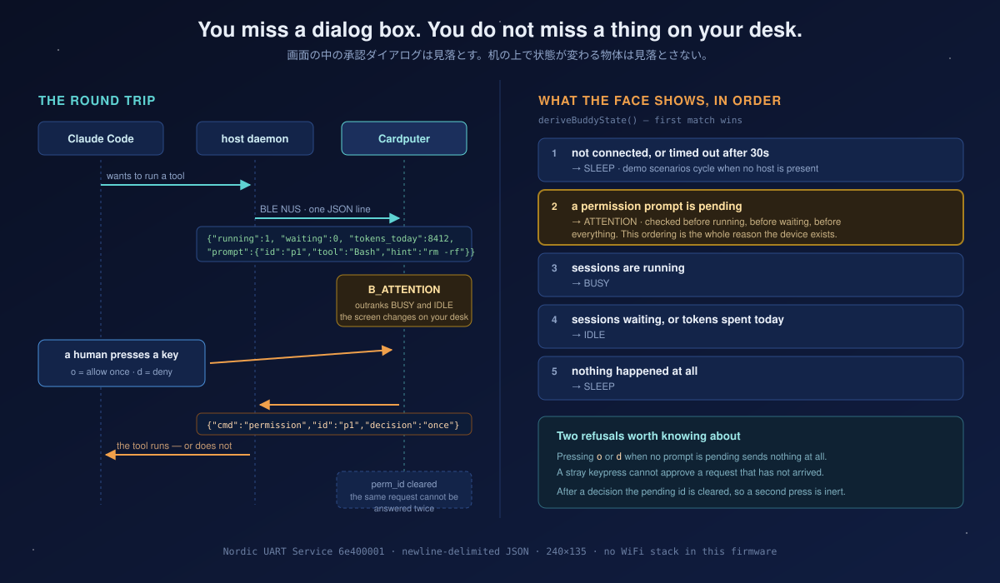

<h1 align="center">Claude Cardputer Buddy</h1>

<p align="center">
  <b>You miss a dialog box. You do not miss a thing on your desk.</b><br>
  <sub>画面の中の承認ダイアログは見落とす。机の上で顔が変わる物体は見落とさない。</sub>
</p>

<p align="center">
  
  
  
  
  
  
</p>

---

An independent Cardputer-focused adaptation of Anthropic's [`claude-desktop-buddy`](https://github.com/anthropics/claude-desktop-buddy), redesigned for the M5Stack Cardputer's built-in QWERTY keyboard and device-specific UX.

The buddy shows what your Claude Code sessions are doing — and when one of them asks for permission, **it says so before it says anything else**, and you answer with a physical key.

Character / artwork assets are not included by default unless their license is explicitly confirmed. See [`THIRD_PARTY_ASSETS.md`](THIRD_PARTY_ASSETS.md).

---

## The permission round trip

<p align="center">
  
</p>

The ordering in that right-hand column is the point of the whole device. `deriveBuddyState()` checks for a pending permission prompt **before** it checks whether sessions are running, whether any are waiting, or whether tokens were spent today. A busy agent and an agent blocked on your approval look completely different from across the room — and the second one wins.

> 右側の優先順位がこのデバイスの存在理由です。実行中かどうかより先に「許可を待っているか」を見る。部屋の反対側からでも、動いているエージェントと**あなたを待っている**エージェントが区別できます。

### Two refusals built into the firmware

- Pressing `o` or `d` when **no prompt is pending sends nothing at all.** A stray keypress cannot approve a request that has not arrived.
- After a decision is sent, the pending id is cleared. **The same request cannot be answered twice.**

Neither is a safety feature bolted on afterwards. They are two `if` statements that exist because a physical approval button is only trustworthy if it is inert the rest of the time.

---

## Why the Cardputer

The upstream reference targets the M5StickC Plus, which has two buttons. Two buttons are enough to *acknowledge* something. They are not enough to *answer* it.

The Cardputer has a **56-key QWERTY keyboard**, so `o` (allow once) and `d` (deny) are distinct, labelled, unambiguous keys. You are not counting presses or holding one for two seconds. You press the letter that matches the decision.

### What changed from the upstream reference

| Item | Upstream (M5StickC Plus) | This repo (Cardputer) |
|------|--------------------------|----------------------|
| MCU | ESP32 | ESP32-S3 |
| BLE | ESP32 built-in BLE | NimBLE-Arduino |
| Display | 135×240 | 240×135 (same panel, rotated) |
| Power | AXP192 | M5Cardputer Power API |
| Input | 2 buttons | QWERTY keyboard |
| IMU | Accelerometer (shake) | Not required by this firmware |

---

## Build and flash

Requirements: an M5Stack Cardputer, a USB-C **data** cable, and [PlatformIO Core](https://docs.platformio.org/en/latest/core/installation/index.html).

```bash
git clone https://github.com/UMEBOSHIISAN/claude-cardputer-buddy.git
cd claude-cardputer-buddy

pio run --target upload      # compile + flash firmware
pio run --target uploadfs    # flash LittleFS (character GIFs, if you added any)
pio device monitor           # serial log
```

With no host connected the device boots into **demo mode** and cycles through scenarios, so a fresh flash shows something alive before you have written any host software.

---

## Keyboard

| Key | Action | Note |
|-----|--------|------|
| `o` | Permission — allow once | inert unless a prompt is pending |
| `d` | Permission — deny | inert unless a prompt is pending |
| `m` | Force demo mode | debugging |
| `s` | Send status JSON to host | uptime and free heap |
| `u` | Clear BLE bond info | restart afterwards to re-pair |

---

## BLE protocol

Nordic UART Service, same as upstream. Payloads are UTF-8 JSON, **one object per line**.

- Service `6e400001-b5a3-f393-e0a9-e50e24dcca9e`
- RX `6e400002-…` (host → device)
- TX `6e400003-…` (device → host, notify)

### Host → device

A session update. Every field is optional; the device keeps its previous value for anything absent.

```json
{
  "total": 3,
  "running": 1,
  "waiting": 0,
  "tokens_today": 8412,
  "msg": "running tests",
  "prompt": { "id": "p1", "tool": "Bash", "hint": "rm -rf build/" }
}
```

Include `prompt` while a session is blocked on approval; omit it when nothing is pending. Commands share the same channel:

| Payload | Effect |
|---|---|
| `{"cmd":"owner","name":"…"}` | Sets the displayed owner name |
| `{"cmd":"name","name":"…"}` | Sets the device name |
| `{"cmd":"status"}` | Device replies with uptime and free heap |
| `{"cmd":"unpair"}` | Clears bond info |
| `{"time":[…]}` | Supplies host time |

### Device → host

Exactly one message type is generated by a keypress:

```json
{ "cmd": "permission", "id": "p1", "decision": "once" }
```

`decision` is `once` or `deny`. The `id` always echoes the prompt being answered, so a host that has already moved on can safely ignore a stale reply.

### Timing

| Constant | Value | Meaning |
|---|---|---|
| `IDLE_TIMEOUT_MS` | 30 s | No message for this long → the device drops to its sleep state |
| `HB_INTERVAL_MS` | 10 s | Suggested host heartbeat interval |
| `DEMO_SCENE_MS` | 8 s | Time per demo scenario when no host is connected |

**There is no WiFi stack in this firmware.** The only IO is BLE to your machine and the TFT panel. The device cannot reach the internet even if you ask it to.

---

## Character assets

Place GIFs at `data/chars/<species>/<state>.gif` and flash them with `pio run --target uploadfs`.

```
data/chars/
  default/
    idle.gif  busy.gif  attention.gif
    celebrate.gif  sleep.gif  dizzy.gif  heart.gif
```

> ⚠️ **No third-party character assets are bundled unless their license is explicitly confirmed.** Read [`THIRD_PARTY_ASSETS.md`](THIRD_PARTY_ASSETS.md) before adding artwork, redistributing, or forking — it documents both the current exclusions and a known limitation regarding this repository's git history. Bring your own art, or let the firmware render the states as shapes.

---

## Attribution

This repository is an independent adaptation inspired by Anthropic's
[`claude-desktop-buddy`](https://github.com/anthropics/claude-desktop-buddy),
reworked for M5Stack Cardputer-specific hardware, input handling, and firmware behavior.

| | Upstream | This repo |
|---|---|---|
| Scope | Reference / example | Cardputer-targeted port |
| License | MIT | MIT (code only — see below) |
| Relationship | Original | Independent adaptation |

**Code:** MIT License — see [`LICENSE`](LICENSE)
**Third-party assets:** see [`THIRD_PARTY_ASSETS.md`](THIRD_PARTY_ASSETS.md)

---

## Project layout

```
claude-cardputer-buddy/
├── platformio.ini
├── src/
│   ├── main.cpp            loop, keyboard handling, permission sender
│   ├── config.h            UUIDs, timeouts, key bindings
│   ├── state_machine.h     DeviceMode, BuddyState, deriveBuddyState()
│   ├── ble_handler.*       NimBLE NUS server, JSON parsing
│   ├── display_handler.*   240×135 rendering
│   └── char_system.*       LittleFS character loading
├── data/chars/             character GIFs (not bundled — see above)
└── docs/
    ├── ROADMAP.md
    └── permission-loop.svg
```

See [docs/ROADMAP.md](docs/ROADMAP.md) for planned extensions including M5Stack ecosystem modules (GPS, camera, ENV sensor, NFC/RFID).

---

## Related

This buddy is the hardware end of a set of small projects built around one rule: **nothing acts without a human.**

| Project | Role |
|---|---|
| [mothership](https://github.com/UMEBOSHIISAN/mothership) | The portable control plane behind these projects — contracts, diagnostics, and the authority boundary |
| [claude-egg](https://github.com/UMEBOSHIISAN/claude-egg) | A Cardputer pet that grows from your Claude Code minutes instead of reporting live state |
| [m5-agent-stars](https://github.com/UMEBOSHIISAN/m5-agent-stars) | The same idea on an M5StickC Plus |
| [secretary-tui](https://github.com/UMEBOSHIISAN/secretary-tui) | The read-only terminal version of "show me, do not decide for me" |

A permission key you can physically press is the most literal form of that rule. Everything else in the constellation is the same idea with fewer photons.
